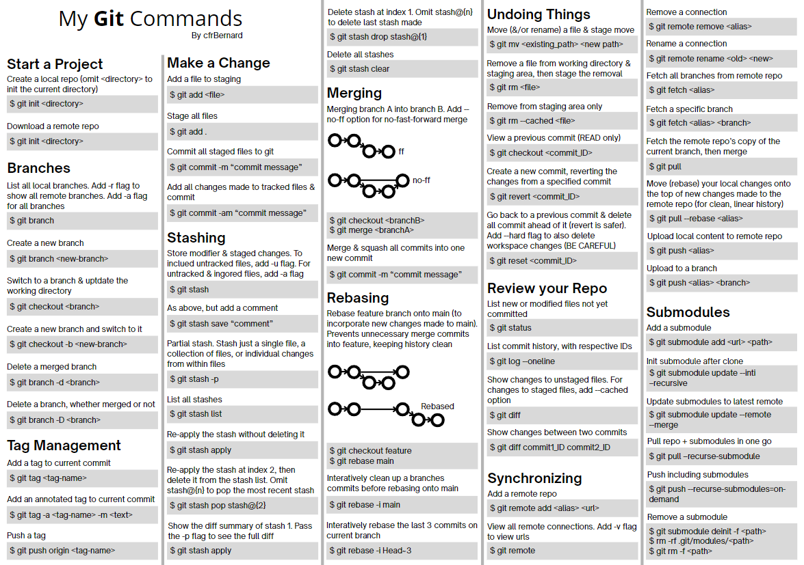

# MyGitCheatSheet

I created this Git cheat sheet because I needed a reference that includes not only the usual commands, but also some less common ones I use frequently – especially **submodule commands**.  

[**Download the latest PDF here**](./My%20Git%20Commands.pdf)

> It's a compact, printable PDF designed for quick access while working on multiple projects. [Based on this](https://doabledanny.gumroad.com/l/git-commands-cheat-sheet-pdf)

---

  

--- 

> This project is licensed under the MIT License. See the [LICENSE](./LICENSE.md) file for details.
